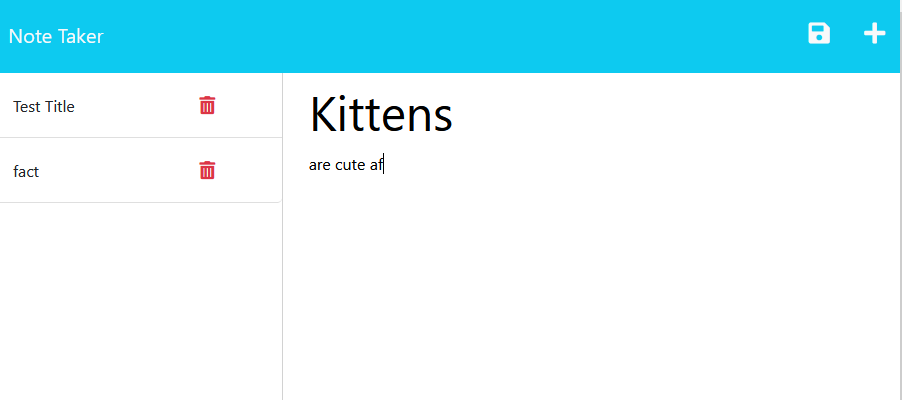

# Note-Taker
This week required modification a starter code to create an application called Note Taker that can be used to write and save notes.

This applications front end was already created I needed to build the back end, connect the two, and then deploy the entire application to Heroku, this application uses an Express.js back end and will save and retrieve note data from a JSON file. 

## Screenshots

## Link to Deployed Application

https://shs-peb.github.io/Note-Taker/